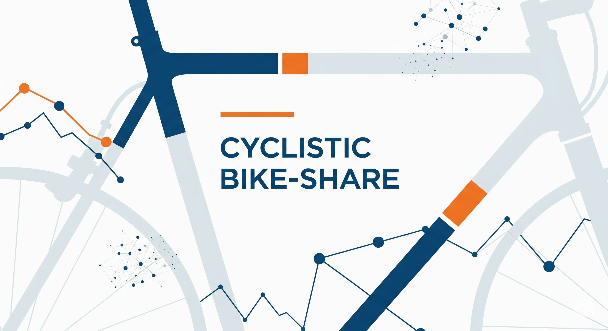

# 🚴‍♂️ Cyclistic Bike-Share | Estudo de Comportamento de Usuários

## 📌 Visão Geral

Este projeto é baseado em um estudo de caso realista no qual atuo como **analista de dados júnior** da equipe de marketing da **Cyclistic**, um programa de compartilhamento de bicicletas com sede em Chicago. Desde seu lançamento em 2016, a Cyclistic cresceu para uma frota de mais de **5.800 bicicletas** distribuídas em **mais de 600 estações**, oferecendo inclusive modelos adaptados, como triciclos de mão e bicicletas de carga, promovendo acessibilidade e inclusão.

A empresa oferece diferentes planos de uso: passe único, passe diário e assinatura anual. Atualmente, os **usuários casuais** (que usam passes pontuais) e os **membros anuais** apresentam comportamentos distintos, e entender essas diferenças é essencial para o próximo passo estratégico da empresa.

A diretora de marketing, **Lily Moreno**, acredita que o sucesso futuro da Cyclistic depende de **converter ciclistas casuais em membros anuais**, já que os membros geram maior receita recorrente. Para isso, é necessário identificar padrões de uso entre os diferentes perfis e fornecer à equipe executiva **recomendações embasadas em dados e visualizações profissionais**.

O objetivo deste projeto é analisar os dados históricos de viagens da Cyclistic para gerar **insights práticos que apoiem decisões estratégicas de marketing**, usando as etapas do processo analítico: *Perguntar, Preparar, Processar, Analisar, Compartilhar e Agir*.

---

## ⚙️ Abordagem / Etapas

### 1. Perguntar

Três perguntas fundamentais orientarão o desenvolvimento do novo programa de marketing da Cyclistic:

> 1. *Como os membros anuais e os ciclistas casuais utilizam as bicicletas da Cyclistic de forma diferente?*
> 2. *Por que os ciclistas casuais considerariam adquirir uma assinatura anual da Cyclistic?*
> 3. *Como a Cyclistic pode usar mídias digitais para incentivar ciclistas casuais a se tornarem membros anuais?*

Essas perguntas são o ponto de partida da análise e irão guiar todo o processo investigativo nas etapas seguintes.

#### 1.1 Hipóteses iniciais de análise

Antes de iniciar a análise, foram elaboradas algumas hipóteses que refletem possíveis padrões de comportamento entre usuários casuais e membros:

> 1. *Usuários casuais utilizam mais as bicicletas aos finais de semana, especialmente sexta, sábado e domingo; enquanto membros usam de forma mais distribuída ao longo da semana*.
> 2. *O uso das bicicletas é maior durante as estações mais quentes, como o verão (junho a setembro) e o outono (setembro a novembro)*.
> 3. *Usuários casuais tendem a utilizar as bicicletas próximas a áreas de lazer, como parques, enquanto membros utilizam para deslocamentos urbanos mais distribuídos pela cidade*.
> 4. *Feriados aumentam o uso das bicicletas por usuários casuais, indicando um comportamento mais voltado ao lazer e ao turismo*.

### 2. Preparar

Nesta etapa, foram definidos os recursos e ferramentas necessários para conduzir a análise, além da origem e licença dos dados utilizados.

Os dados históricos de viagens foram obtidos por meio do portal oficial da Divvy, disponível em:  
🔗 [divvy-tripdata](https://divvy-tripdata.s3.amazonaws.com/index.html)

O uso dos dados é permitido conforme os termos da licença disponibilizada pela Divvy:  
🔗 [Data License Agreement](https://divvybikes.com/data-license-agreement)

**Ferramentas:**  
- Limpeza e manipulação de dados — Python (Pandas, NumPy)  
- Visualização de dados — Matplotlib, Seaborn  
- Ambiente de desenvolvimento — Jupyter Notebook

### 3. Processar
