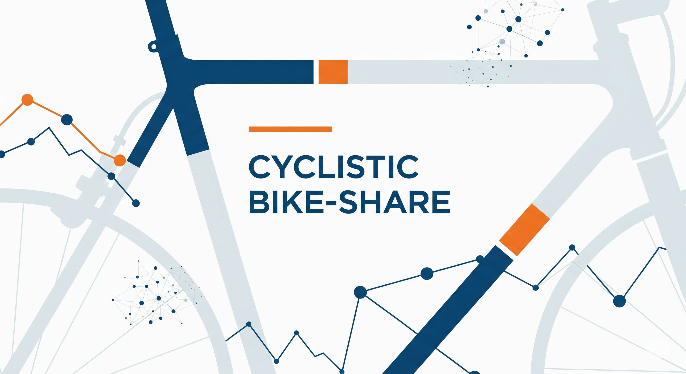

# 🚴‍♂️ Cyclistic Bike-Share | Estudo de Comportamento de Usuários

## 📌 Visão Geral

Este projeto é baseado em um estudo de caso realista no qual atuo como **analista de dados júnior** da equipe de marketing da **Cyclistic**, um programa de compartilhamento de bicicletas com sede em Chicago. Desde seu lançamento em 2016, a Cyclistic cresceu para uma frota de mais de **5.800 bicicletas** distribuídas em **mais de 600 estações**, oferecendo inclusive modelos adaptados, como triciclos de mão e bicicletas de carga, promovendo acessibilidade e inclusão.

A empresa oferece diferentes planos de uso: passe único, passe diário e assinatura anual. Atualmente, os **usuários casuais** (que usam passes pontuais) e os **membros anuais** apresentam comportamentos distintos, e entender essas diferenças é essencial para o próximo passo estratégico da empresa.

A diretora de marketing, **Lily Moreno**, acredita que o sucesso futuro da Cyclistic depende de **converter ciclistas casuais em membros anuais**, já que os membros geram maior receita recorrente. Para isso, é necessário identificar padrões de uso entre os diferentes perfis e fornecer à equipe executiva **recomendações embasadas em dados e visualizações profissionais**.

O objetivo deste projeto é analisar os dados históricos de viagens da Cyclistic para gerar **insights práticos que apoiem decisões estratégicas de marketing**, usando as etapas do processo analítico: *Perguntar, Preparar, Processar, Analisar, Compartilhar e Agir*.

---

## ⚙️ Abordagem / Etapas

### 1. Perguntar

Três perguntas fundamentais orientarão o desenvolvimento do novo programa de marketing da Cyclistic:

> 1. *Como os membros anuais e os ciclistas casuais utilizam as bicicletas da Cyclistic de forma diferente?*
> 2. *Por que os ciclistas casuais considerariam adquirir uma assinatura anual da Cyclistic?*
> 3. *Como a Cyclistic pode usar mídias digitais para incentivar ciclistas casuais a se tornarem membros anuais?*

Essas perguntas são o ponto de partida da análise e irão guiar todo o processo investigativo nas etapas seguintes.

#### Hipóteses iniciais

Antes de iniciar a análise, elaborei algumas hipóteses que refletem possíveis padrões de comportamento entre usuários casuais e membros.

> 1. *Usuários casuais utilizam mais as bicicletas aos finais de semana, especialmente sexta, sábado e domingo; enquanto membros usam de forma mais distribuída ao longo da semana*.
> 2. *O uso das bicicletas é maior durante as estações mais quentes, como o verão (junho a setembro) e o outono (setembro a novembro)*.
> 3. *Usuários casuais tendem a utilizar as bicicletas próximas a áreas de lazer, como parques, enquanto membros utilizam para deslocamentos urbanos mais distribuídos pela cidade*.
> 4. *Feriados aumentam o uso das bicicletas por usuários casuais, indicando um comportamento mais voltado ao lazer e ao turismo*.

### 2. Preparar

Nesta etapa, defini os recursos e ferramentas necessários para conduzir a análise, além de identificar a origem e a licença dos dados utilizados.

Os dados históricos de viagens foram obtidos por meio do portal oficial da Divvy, disponível em:  
🔗 <a href="https://divvy-tripdata.s3.amazonaws.com/index.html" target="_blank">divvy-tripdata</a>

O uso dos dados é permitido conforme os termos da licença disponibilizada pela Divvy:  
🔗 <a href="https://divvybikes.com/data-license-agreement" target="_blank">Data License Agreement</a>

**Ferramentas:**  
- Limpeza e manipulação de dados — Python (Pandas, Numpy)  
- Visualização de dados — Matplotlib, Seaborn  
- Ambiente de desenvolvimento — Jupyter Notebook

### 3. Processar

Para esta análise, utilizei as bases de dados referentes ao ano de 2024. Dividi o processamento nas seguintes etapas:

1) [Combinação de Dados (Data Combination)](notebooks/01-Data-Combination.ipynb)
2) [Exploração de Dados (Data Exploration)](notebooks/02-Data-Exploration.ipynb)
3) [Limpeza de Dados (Data Cleaning)](notebooks/03-Data-Cleaning.ipynb)
4) [Análise de Dados (Data Analysis)](notebooks/01-Data-Combination.ipynb)

#### Combinação de Dados
As tabelas de janeiro de 2024 a dezembro de 2024 foram empilhadas em uma única tabela, totalizando 5.860.568 linhas.

#### Exploração de Dados

Nesta etapa, o foco foi entender melhor como os dados estão distribuídos e identificar possíveis padrões. Foram analisados os valores únicos, presença de nulos, outliers e a distribuição geral das variáveis.

| **Nº** | **Coluna**         | **Descrição**                                 |
|--------|--------------------|-----------------------------------------------|
| 1      | ride_id            | Identificador único de cada viagem            |
| 2      | rideable_type      | Tipo de bicicleta utilizada na viagem         |
| 3      | started_at         | Data e hora de início da viagem               |
| 4      | ended_at           | Data e hora de término da viagem              |
| 5      | start_station_name | Nome da estação onde a viagem foi iniciada    |
| 6      | start_station_id   | Identificador da estação de início da viagem  |
| 7      | end_station_name   | Nome da estação onde a viagem foi finalizada  |
| 8      | end_station_id     | Identificador da estação de término da viagem |
| 9      | start_lat          | Latitude do ponto de partida da viagem        |
| 10     | start_lng          | Longitude do ponto de partida da viagem       |
| 11     | end_lat            | Latitude do ponto de chegada da viagem        |
| 12     | end_lng            | Longitude do ponto de chegada da viagem       |
| 13     | member_casual      | Categoria do usuário                          |

Essa análise inicial ajudou a ter uma visão mais clara da base e direcionar os próximos passos do projeto.

#### Limpeza de Dados

Nesta etapa, fiz alguns ajustes importantes para preparar os dados para a análise:

- Removi registros duplicados na coluna `ride_id`
- Excluí linhas com valores nulos
- Converti as colunas `started_at` e `ended_at` para o formato `datetime` e arredondei os valores para segundos (`HH:MM:SS`)
- Eliminei linhas onde o horário de início era maior ou igual ao horário de término
- Criei a coluna `ride_length` com a duração da viagem (término - início)
- Criei a coluna `day_of_week` para identificar o dia da semana da viagem (1 = domingo, 7 = sábado)
- Criei a coluna `month` para identificar o mês da viagem
- Criei a coluna `is_holiday` para verificar se o dia da viagem era feriado ou não

Após esses passos, a base final ficou com **4.207.936 linhas**, ou seja, **removi 1.652.632 linhas** com dados inválidos ou incompletos para análise.

### 4. Analisar

#### Análise de Dados

